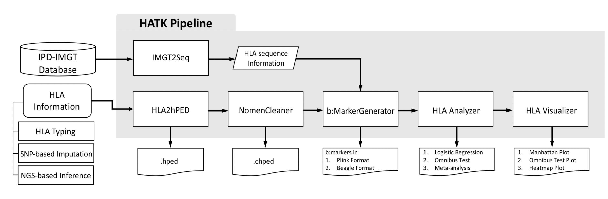

# HLA Analysis Toolkit (HATK; v2.0)

## (1) Introduction

`HATK`(**HLA Analysis Tool-Kit**) is a collection of tools and modules to perform `HLA fine-mapping` analysis, **which is to identify which HLA allele or amino acid position of the HLA gene is driving the disease**. HLA fine-mapping analysis is an indispensable analysis in studies of autoimmune diseases.

In `GWAS`(**Genome-wide Association Test**) and its fine-mapping analysis, researchers can obtain candidate causal variants of the target disease. However, the association test performed on the variants in the HLA(Human Leukocyte Antigen) region, chromosome 6p21, usually shows unreliable results because this region has an outlandish polymorphism. Consequently, Performing conventional association test based on SNP array panel may generate inaccurate signals in the HLA region.

On the other hand, the `IPD-IMGT/HLA`, which is a specialist database, provides the official and most detailed information of the HLA region. Being updated 4 times a year, they keep and manage whole HLA allele information and name those alleles based on the nomenclature defined by the '`WHO Nomenclature Committee For Factors of the HLA System`’. Furthermore, they provide each HLA allele's (1) amino acid and (2) DNA sequence information. To use these data, Exact HLA allele information of patients is required and researchers may have to employ expensive HLA typing technologies. However, thanks to the recent development of HLA imputation and inference technologies, researchers now can obtain hundreds to thousands of patients’ HLA allele information and detour the cost issue of using HLA typing service.

Ultimately, HATK aims to perform an association test targeted to the HLA region. Based on patients’ HLA type information and its corresponding Amino acid and DNA sequence information distributed by the IMGT-HLA database, HATK builds a marker panel including not only the typical intergenic genomic variants(i.e. SNPs) markers but also variants of HLA region. Also, HATK provides the additional association test method so that researchers can analyze the signals arising in the amino acid sequence position.




<br>
<br>


## (2) Installation

First, Prepare OS X(Mac) or Linux operating system. HATK currently doesn't support Windows. It was checked that HATK can work in the next specific operating systems.

- Linux : 
    - Ubuntu 19.04(Disco Dingo)
    - Ubuntu 18.04.3 LTS(Bionic Beaver)
    - CentOS_7
    - Linux Mint 19.2 Cinnamon(Tina)
- OS X : 
    - Catalina(**with Bash NOT Zsh**)
    - Mojave

    In case of using Catalina OS X, **Make sure your default shell is 'Bash($)' not 'Zsh(%)'**. To change the default shell to Bash, Please reference this blog(https://www.howtogeek.com/444596/how-to-change-the-default-shell-to-bash-in-macos-catalina/).

<br>

Then, Download this project in somewhere directory of your OS X or Linux system. It will be assumed that 'git' command is already installed in your system.

```
$ git clone https://github.com/WansonChoi/HATK.git
$ cd HATK
```
<br>

We strongly recommend using the latest version of 'Anaconda(or Miniconda)' to set up HATK.


1. install Anaconda or Miniconda.

    - Anaconda : (https://www.anaconda.com/)
    - Miniconda : (https://docs.conda.io/en/latest/miniconda.html)

<br>

2. Create a new independent Python virtual environment with the given YML file.

	By using 'HATK_LINUX.yml' or 'HATK_OSX.yml' file in the project folder **depending on your operating system**, Create a new Python virtual environment.
    
	```
	$ conda env create -f HATK_OSX.yml          ## OS X(Mac)
	$ conda env create -f HATK_LINUX.yml        ## Linux
	```
	
	The above command will generate a new Python virtual environment named 'HATK', which contains dependent Python packages, R and R libraries, independent to your original Python system. For more detailed explanation about Anaconda's managing Python virtual environment, Please check this reference(https://docs.conda.io/projects/conda/en/latest/user-guide/tasks/manage-environments.html#create-env-file-manually).

	If the new virtual environment has been succuessfully installed, then activate it.

	```
	$ conda activate HATK
	```


    HATK will be implemented in this virtual environment. 

<!-- <br>

3. Install 'R' statistical programming language and the next three R libraries.

    - gplots
    - RColorBrewer
    - shape

    These 3 libraries are required to plot Heatmap. Otherwise, Heatmap will fail.

    ```
    $ Rscript -e "install.packages(c('gplots', 'RColorBrewer', 'shape'), dependencies=TRUE, repos='https://cran.cnr.berkeley.edu/')"
    ```

    > (Tip) You can use another CRAN repository. Choose the one located near to your country. (https://cran.r-project.org/mirrors.html) -->


<br>


> (Tip) Type '_conda acitvate base_' on your command line if you want to go back to your original Python system setting. (https://docs.conda.io/projects/conda/en/latest/user-guide/tasks/manage-environments.html#deactivating-an-environment)


> (Tip) Type '_conda env remove -n HATK_' in your command line if you want to remove this newly created virtual environment for HATK forever in your Anaconda. (https://docs.conda.io/projects/conda/en/latest/user-guide/tasks/manage-environments.html#removing-an-environment)

<br>
<br>


## (3) Usage example

``` 
python HATK.py \
    --hg 18 \
    --hped example/wtccc_filtered_58C_RA.hatk.300+300.hped2 \
    --bfile example/wtccc_filtered_58C_RA.hatk.300+300.hg18.chr6.29-34mb \ # "--variants" in the v1.
    --pheno example/wtccc_filtered_58C_RA.hatk.300+300.phe \
    --pheno-name RA \
    --imgt 3320 \
    --imgt-dir example/IMGTHLA3320/ \
    --multiprocess 8 \
    --out HATKv2_wholeImple/wtccc_58C+RA.hg18.chr6.29-34mb.ALL' \
    --java-mem 4g \
    --nthreads 4
```

This command will implement (1) IMGT2Seq, (2) NomenCleaner, (3) bMarkerGenerator, (4) HLA_Analyzer(Association Test - logistic regression), (5) Manhattan Plot and (6) Heatmap Plot, which are the minimal components for HLA fine-mapping analysis.

Each module of HATK can be implemented repectively. **The README files of each of those modules are prepared in 'docs/' folder.** Those files include more detailed explanation and respective usage examples.

> **Check which Human Genome version, e.g. hg18, hg19 or hg38, is being used in your study**. HATK dosen't take responsibility for the case where different Human Genome versions are used. For example, SNP array data with 'hg19' and passing '18' to '-hg' argument.

<br>
<br>

## (4) Citation
HATK: HLA analysis toolkit - Wanson Choi, Yang Luo, Soumya Raychaudhuri, Buhm Han
(https://academic.oup.com/bioinformatics/advance-article/doi/10.1093/bioinformatics/btaa684/5879278)

<br>
<br>


## (5) License

The HATK Software Code is freely available for non-commercial academic research use. If you would like to obtain a license to the Code for commercial use, please contact Wanson Choi (WC) at wansonchoi@snu.ac.kr and Buhm Han (BH) at buhm.han@snu.ac.kr. WE (WC and BH) MAKE NO REPRESENTATIONS OR WARRANTIES WHATSOEVER, EITHER EXPRESS OR IMPLIED, WITH RESPECT TO THE CODE PROVIDED HERE UNDER. IMPLIED WARRANTIES OF MERCHANTABILITY OR FITNESS FOR A PARTICULAR PURPOSE WITH RESPECT TO CODE ARE EXPRESSLY DISCLAIMED. THE CODE IS FURNISHED "AS IS" AND "WITH ALL FAULTS" AND DOWNLOADING OR USING THE CODE IS UNDERTAKEN AT YOUR OWN RISK. TO THE FULLEST EXTENT ALLOWED BY APPLICABLE LAW, IN NO EVENT SHALL WE BE LIABLE, WHETHER IN CONTRACT, TORT, WARRANTY, OR UNDER ANY STATUTE OR ON ANY OTHER BASIS FOR SPECIAL, INCIDENTAL, INDIRECT, PUNITIVE, MULTIPLE OR CONSEQUENTIAL DAMAGES SUSTAINED BY YOU OR ANY OTHER PERSON OR ENTITY ON ACCOUNT OF USE OR POSSESSION OF THE CODE, WHETHER OR NOT FORESEEABLE AND WHETHER OR NOT WE HAVE BEEN ADVISED OF THE POSSIBILITY OF SUCH DAMAGES, INCLUDING WITHOUT LIMITATION DAMAGES ARISING FROM OR RELATED TO LOSS OF USE, LOSS OF DATA, DOWNTIME, OR FOR LOSS OF REVENUE, PROFITS, GOODWILL, BUSINESS OR OTHER FINANCIAL LOSS.


<!-- comment 
## \<History\>

2nd Repository for HATK project.

(2018. 8. 2.)
Remote repository has been moved from Bitbucket to Github.


(2018. 12. 19.)
The branch 'b_20181219' has been created to
	(1) introduce logging system,
	(2) optimize and enhance the general performance,

and etc. 


(2019. 1. 10.)
The core engine modules("HLAtoSequences.py", "encodeVariants.py", "encodeHLA.py") are reworked urgently to solve the memroy usage problem(It was found to use maximum 64G RAM apporximately maybe due to Pandas).

The rework was primarily done in the work with Yang Luo in the repository of "MakeReference_v2" and the finalized rework outputs are applied to this project.
-->


<!-- ## (2) Backgrounds

#### [Extreme Polymorphism in HLA region]

- Genes in the HLA region are well known for their extreme polymorphism. For example, It has been found that there are at least 7,000 alleles for the HLA-B gene and other HLA genes also usually have more than 100 alleles. (<https://www.ebi.ac.uk/ipd/imgt/hla/stats.html>) Furthermore, while the SNPs in the most of genome are assumed to be bi-allelic, which means only two kinds of different alleles appear in each position of those SNPs, the SNPs in the HLA region are often more than bi-allelic.
- NGS technique with Human Reference Genome and most SNP array panel, which lots of genomic researchers employ, actually assume that all SNPs are bi-allelic including the SNPs in the HLA region. That's why the result of the association test on the HLA region is usually inaccurate.
- The IPD-IMGT/HLA database is a specialist database and provides the official amino acid and DNA sequence of each HLA allele. This information can be used to make a marker panel of the researcher's study samples where this marker panel can include the polymorphism of the HLA region.
- The IPD-IMGT/HLA database not only supervises the sequence information but also names those official sequences based on the nomenclature defined by the `WHO Nomenclature Committee For Factors of the HLA System`(<http://hla.alleles.org/nomenclature/committee.html>).

- Also, the IMGT-HLA database continuously updates itself 4 times a year, collecting new HLA alleles and their sequence information.
- HLA researchers may want to choose the latest or specific version of the IMGT-HLA database.

- HATK provides a module IMGT2Seq which can pre-process data files distributed by the IMGT-HLA database with the specific version. By processing the data to dictionary files, the IMGT2Seq not only facilitates the following steps of HATK but also lets researchers use that information more conveniently. Please check '_1_IMGT2Seq.md' file in 'docs/' folder for more details about the IMGT2Seq.


#### [HLA Nomenclature]

- As mentioned above, it is common for HLA genes to have more than 100, even thousands, alleles due to its polymorphism. Consequently, To handle those many alleles, the '`WHO Nomenclature Committee For Factors of the HLA System`’ introduced their own nomenclature system and names all those alleles based on this nomenclature.

- The 1st nomenclature without separator (ex. A*3301) was introduced in 1987. However, as more and more new HLA alleles were found, that nomenclature became not enough to embrace all those alleles, which is called 'rollover' problem. So, around 2010, '`The WHO Nomenclature Committee for Factors of the HLA System`' met and updated the old nomenclature(http://hla.alleles.org/nomenclature/naming_2010.html).

- Also, in the updated nomenclature, two more nomenclatures, P-code and G-code, were newly introduced to effectively classify HLA alleles based on the difference in the 2nd and 3rd exon of amino acid or DNA sequence. Researchers may have to convert HLA alleles given in `P-code` or `G-code` nomenclature to the ones in the `standard` nomenclature.

- The thing is that both old and updated nomenclature can be used in the HLA research area. In other words, some research groups keep their patients' HLA type information in the old nomenclature and other groups do it in the updated one. Researches may confront a situation where they have to check whether the given HLA allele is in either the old or updated nomenclature. Also, they might need to convert a given HLA allele name within the old nomenclature to its updated one.

- The field-separator is often omitted implicitly though the updated nomenclature is used. Sometimes researchers need to retrieve that field information back. For example, if the allele DPB1\*101101 is given, then researchers need to determine whether this allele corresponds to DBP1\*10:11:01, DPB1\*101:101 or DPB1\*1011:01. The actual answer for this is DPB1\*1011:01 in the IMGT version 3.37.0.

- The module NomenCleaner undertakes those converting jobs including field-checking function.  Please check '_3_NomenCleaner.md' file in 'docs/' folder for more details about the NomenCleaner.


#### [Various sources to acquire patients’ HLA type information]

- `HLA type information` of patients is required to bring the amino acid and DNA sequence information distributed by the IMGT-HLA database.
- To get the patients' HLA type information, the gold-standard way is to take advantage of sequencing-based **HLA typing service**. However, **this way usually takes lots of costs for researchers**.
- Thanks to the recent development of HLA imputation and inference technologies, researchers now can obtain patients’ HLA allele information without using the HLA typing service and detour the cost issue.
- There are lots of software that realize that HLA imputaton or inference. However, the output of each of that software, i.e. output file format, containing HLA type information also varies. Researchers may perform additional text-processing to merge and integrate those results.
- Here, we introduced a new file format `HLA PED(HPED)` where all those results from different software can be merged. This file format is similar to the PLINK ped file but consists of 22(6 + 8*2) columns. Left 6 columns are exactly same as Plink ped file ('Family_ID', 'Individual_ID', 'Paternal_ID', 'Maternal_ID', 'Sex', 'Phenotype') and other 16 columns are Individual's HLA diploid (unphased) genotypes(2 HLA alleles for each HLA gene) of **8 HLA genes(A, B, C, DPA1, DPB1, DQA1, DQB1, DRB1; in this order)**.
- HLA2HPED takes the results from each different software and merge them into a new HPED file.

#### [Proper Association Test]

- Under construction. -->