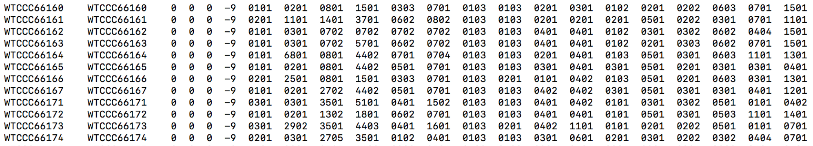
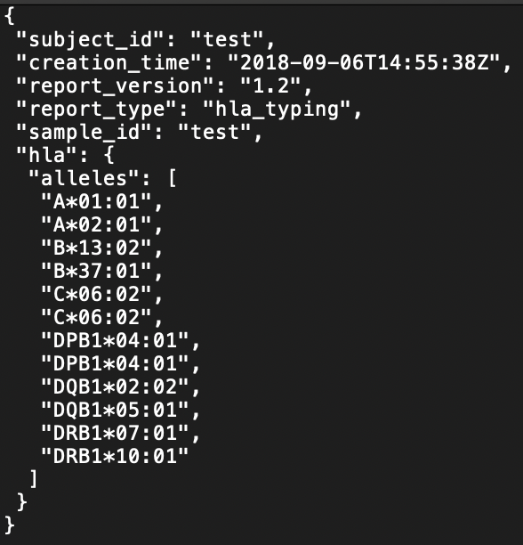
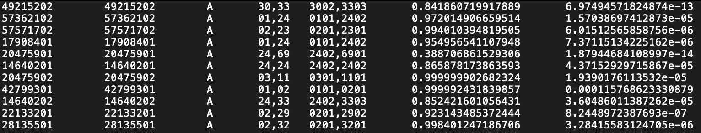

# HLA2HPED

## (1) What is HLA2HPED

`HLA2HPED` is a module to merge and convert the output from other HLA imputation or inference software to `HLA PED(HPED)` file so that researchers can use `HATK` directly using the output of other HLA software. Currently, this module supports **xHLA**, **HIBAG**, and **Axiom** software and it is planned to make HLA2HPED to cover more HLA imputation/inference software output.

`HLA PED(HPED)` file format is similar to the PLINK ped file but consists of 22(6 + 8*2) columns. Left 6 columns are exactly same as PLINK ped file ('Family_ID', 'Individual_ID', 'Paternal_ID', 'Maternal_ID', 'Sex', 'Phenotype'). Other 16 columns are Individual's HLA type information (2 HLA alleles for each HLA gene) of **8 HLA genes(A, B, C, DPA1, DPB1, DQA1, DQB1, DRB1; in this order)**. If some allele values are **not accessible(NA)**, then fill them with just '0'.



(an example of HPED file.)

<br>

## (2) Usage Examples.

1. xHLA

The output of xHLA is assumed to be multiple JSON files each of which represents a single sample's HLA type information. The next photo is an example of the JSON output file of xHLA. Multiple JSON files like this will be given to HLA2HPED with the argument '--rhped'.



```
$ python HATK.py \
    --hla2hped \
    --platform xHLA \
    --out MyHLA2HPED_xHLA/MyxHLA \
    --rhped \
    example/HLA2HPED/xHLA/test.json \
    example/HLA2HPED/xHLA/test2.json \
    example/HLA2HPED/xHLA/test3.json
```

The 1st column, Family_ID, will be set by the sample id, the 2nd column value by default.


<br>

2. HIBAG

HIBAG output is usually generated as files split by HLA. The next photo is an example of one output file which contains HLA-A imputation.

Because HATK focuses on the **8 HLA genes(A, B, C, DPA1, DPB1, DQA1, DQB1, DRB1)**, HLA2HPED will work by taking 8 output files of each HLA gene. **Please pass the files of the 8 HLA genes with that order**.



```
$ python HATK.py \
    --hla2hped \
    --platform HIBAG \
    --out MyHLA2HPED_HIBAG/MyHIBAG \
    --rhped \
    example/HLA2HPED/HIBAG/HIBAG_TestResult.HLA-A.out \
    example/HLA2HPED/HIBAG/HIBAG_TestResult.HLA-B.out \
    example/HLA2HPED/HIBAG/HIBAG_TestResult.HLA-C.out \
    example/HLA2HPED/HIBAG/HIBAG_TestResult.HLA-DPA1.out \
    example/HLA2HPED/HIBAG/HIBAG_TestResult.HLA-DPB1.out \
    example/HLA2HPED/HIBAG/HIBAG_TestResult.HLA-DQA1.out \
    example/HLA2HPED/HIBAG/HIBAG_TestResult.HLA-DQB1.out \
    example/HLA2HPED/HIBAG/HIBAG_TestResult.HLA-DRB1.out

```


If some files of HLA genes are not accessible, then allocate 'NA' to that position of the '--rhped'.

```
$ python HATK.py \
    --hla2hped \
    --platform HIBAG \
    --out MyHLA2HPED_HIBAG/MyHIBAG \
    --rhped \
    NA \
    example/HLA2HPED/HIBAG/HIBAG_TestResult.HLA-B.out \
    NA \
    NA \
    NA \
    NA \
    NA \
    NA

# Using only HLA-B gene information
```

<br>

3. Axiom

The output of Axiom is also generated as split files of respective HLA. Likewise HIBAG, **Please pass the files of the 8 HLA genes with the above order**.

```
$ python HATK.py \
    --hla2hped \
    --platform AXIOM \
    --out MyHLA2HPED_Axiom/MyAxiom \
    --rhped \
    example/HLA2HPED/Axiom/AxiomHLA_4dig_A_Results.txt \
    example/HLA2HPED/Axiom/AxiomHLA_4dig_B_Results.txt \
    example/HLA2HPED/Axiom/AxiomHLA_4dig_C_Results.txt \
    example/HLA2HPED/Axiom/AxiomHLA_4dig_DPA1_Results.txt \
    example/HLA2HPED/Axiom/AxiomHLA_4dig_DPB1_Results.txt \
    example/HLA2HPED/Axiom/AxiomHLA_4dig_DQA1_Results.txt \
    example/HLA2HPED/Axiom/AxiomHLA_4dig_DQB1_Results.txt \
    example/HLA2HPED/Axiom/AxiomHLA_4dig_DRB1_Results.txt    
```
