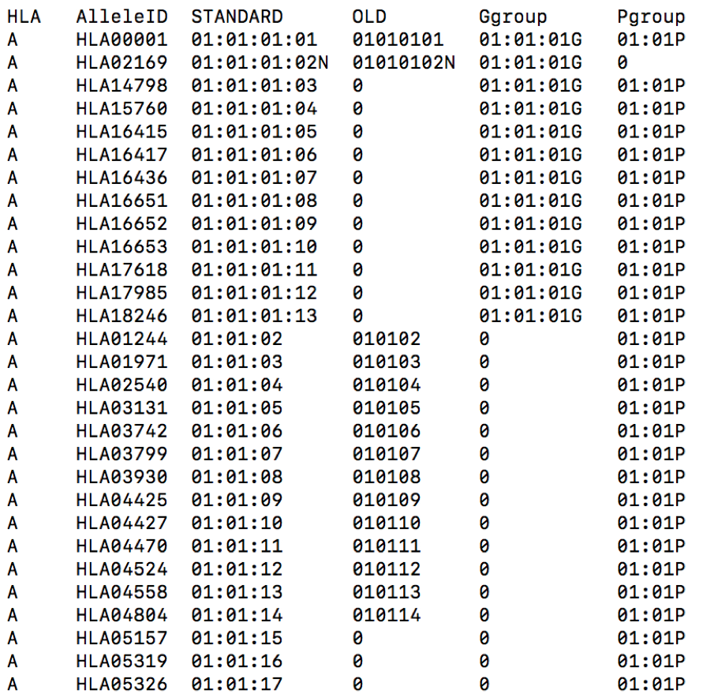
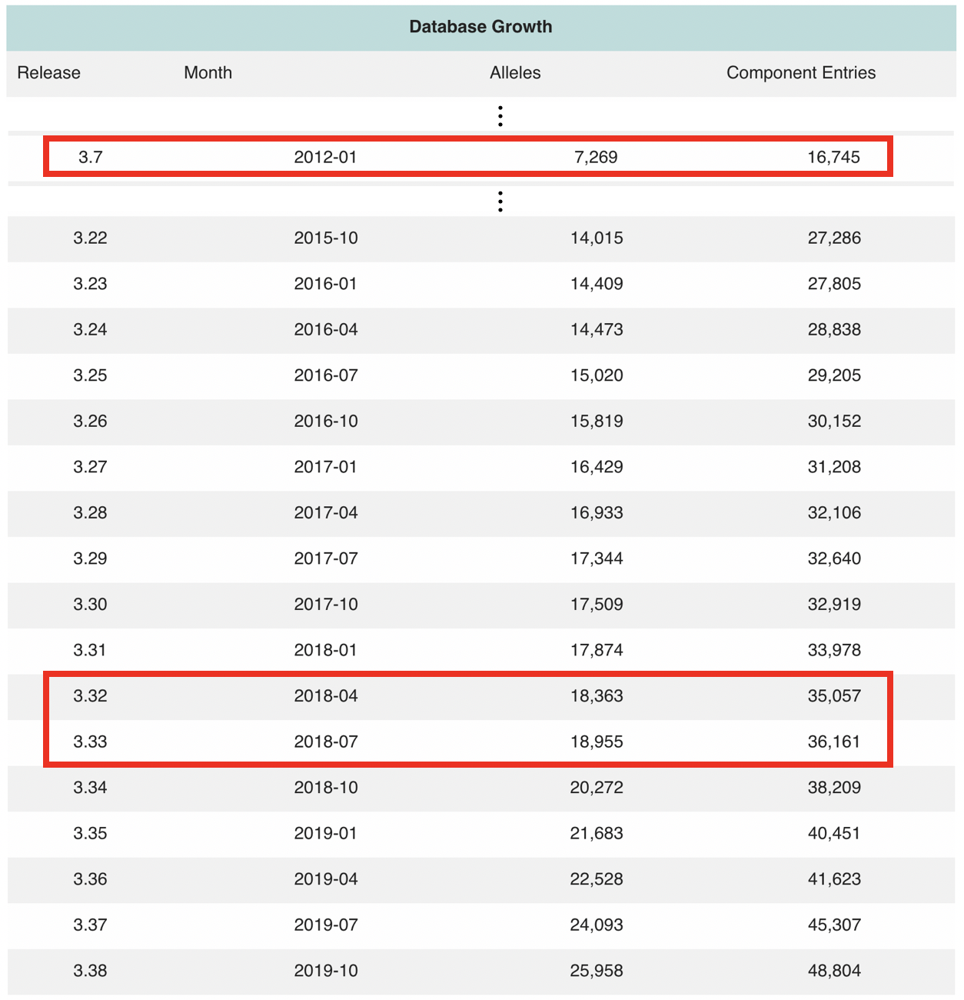

# IMGT2Seq

## (1) Introduction

`IMGT2Seq` basically aims to preprocess the information distributed by the `IMGT-HLA` database and generates more utilizable form of files that can used in the subsequent steps of HATK. More specifically, the IMGT2Seq generates (1) Sequence dictionary, (2) HLA Allele Table, and (3) Maptable files that are necessary input files for `bMarkerGenerator`, `NomenCleaner`,  and `Heatmap`.


#### [Why need the IMGT-HLA database and IMGT2Seq?]

1. Most accurate information of the HLA region

In `Genome-Wide Association Study` and `Next-generation Sequencing` analysis, all `Single Nucleotide Polymorphism(SNP)` are assumed to be bi-allelic, i.e. there are only two variations in each SNP. In most SNPs in the human genome, this is actually true. However, SNPs in the `HLA region` are often more than bi-allelic because this HLA region has extreme polymorphism. In other words, when it comes to the HLA region, NGS technique with Human Reference Genome and most SNP array panels usually can't fully cover the variation of this region. That's why the result of the association test on the HLA region with those techniques is usually unreliable.

The IPD-IMGT/HLA database is a specialist database and provides the official amino acid and DNA sequence of each HLA allele. This information should be used to make a marker panel so that the polymorphism information of the HLA region can be applied. IMGT2Seq pre-processes the data files distributed by the IMGT database and bMarkerGenerator generates a marker panel based on that preprocessed output. By performing the association test on this marker panel, researchers can analyze the signals arising in the HLA region.

<br>

2. Official HLA Nomenclature

The IPD-IMGT/HLA database not only supervises the sequence information but also names those official sequences based on the nomenclature defined by the `WHO Nomenclature Committee For Factors of the HLA System`(<http://hla.alleles.org/nomenclature/committee.html>). IMGT2Seq creates the `HLA Allele Table(HAT)` file which summarizes all the official name strings of each HLA allele in a specific version of the database. The inner content of the HLA Allele Table would be like the below photo.




<br>

3. Continuously expanding Database

The IMGT database updates itself usually 4 times a year. In each update, new HLA alleles are introduced and some existing alleles are merged/removed. The next photo shows that the entire number of found HLA alleles keeps increasing, which means using the latest version of the database is recommended.


(https://www.ebi.ac.uk/ipd/imgt/hla/stats.html - 'Database Growth'.)


Meanwhile, there must be some researchers who want to use the database with a specific version. By using IMGT2Seq, not only can researchers keep using the latest version of the IMGT database easily but also choose the specific version they want to choose.


<br>
<br>

## (2) Usage Example

```
python3 HATK.py \
    --imgt2seq \
    -hg 18 \
    -imgt 3320 \
    -o MyIMGT2Seq/ExamplePrefix.hg18.imgt3320 \
    --imgt-dir example/IMGTHLA3320 \
    --multiprocess 2
```

- The path to the folder of downloaded IPD-IMGT/HLA database must be given to '--imgt-dir' argument. 
- Be aware which version of IMGT database('-imgt') and Human Genome version('-hg') you are going to use.
- Actually, the output prefix, i.e. 'ExamplePrefix', given to the '-o' argument has no effect on the output. However, it is recommended to specify the output prefix so that you don't forget what Human Genome version('-hg') and IMGT version('-imgt') are being used.


<br>
<br>


## (3) Output of IMGT2Seq

Given a downloaded IMGT/HLA database file package, IMGT2Seq will processes those files and generate new 5 files.

The files look like these:

1. HLA_DICTIONARY_AA.hg18.imgt3320.txt
2. HLA_DICTIONARY_AA.hg18.imgt3320.map
3. HLA_DICTIONARY_SNPS.hg18.imgt3320.txt
4. HLA_DICTIONARY_SNPS.hg18.imgt3320.map
5. HLA_ALLELE_TABLE.imgt3320.hat

(You can find these result files in 'example/RESULT_EXAMPLE/' folder.)

- File 1 is a dictionary of amino acid residue sequences ranging from the 1st exon to the last exon. 
- File 2 is a genomic position information of those amino acid sequences. 
- Files 3 and 4 are the same as files 1 and 2 but as to the DNA base pair sequences not only including exons but also introns between them. 
- File 5 is for NomenCleaner. All HLA allele name strings in the given version of the database are processed into file 5. NomenCleaner can convert a given HLA allele name to the updated name by using this file 5.

<br>

#### [Genomic Position]

When it comes to the genomic positions of the amino acids or SNPs in files 2 and 4, they were assigned as follows.

1. **The starting position of the 1st exon** of each HLA gene in the human genome build version(eg. hg18, hg19, or hg38) is picked based on `IGV`(https://software.broadinstitute.org/software/igv/). 
2. The incremented value of that starting position by 1 was allocated to the next base position consecutively.
3. In the case of amino acid residues, the middle point of 3 base pairs of the codon was set to its genomic position value.


**Note that they are not perfectly compatible with those of Human genome build version(ex. hg18, hg19, hg38).** It's mainly because the IPD-IMGT/HLA database is more frequently updated than the Human Genome. So, we made IMGT2Seq share only **the start position of the 1st exon** of each HLA gene based on IGV(https://software.broadinstitute.org/software/igv/). In other words, Consecutively incremented(or decremented) genomic positions are assigned to the rest of the positions except the start position. So, **Please be aware that it's highly undesirable to use the genomic position information generated by HATK in a research which is very sensitive to genomic position values**.

#### [Special Characters]

Users might get confused due to some characters contained in the result of IMGT2Seq such as '*(asterisk)', '.(dot)', or 'x' that look bizarre at first. To understand these characters, users should get the concept of '**Official Reference Sequence**' and '**Virtual Sequence**' defined by the IPD-IMGT/HLA. Official and detailed explanations about this can be found in the next link(https://www.ebi.ac.uk/ipd/imgt/hla/nomenclature/alignments.html).

Briefly, there are the official reference sequences for all HLA genes, e.g. A\*01:01:01:01 for HLA-A, B\*07:02:01:01 for HLA-B, which are used as a reference sequence. Meanwhile, for each HLA allele, all the individual sequence entries are submitted to the IPD-IMGT/HLA database and a virtual sequence is created based on them. This virtual sequence is then aligned to the official reference sequence. Insertions and deletions(Indels) are coming out during this alignment and are marked as '.(dot)'.

Researchers would better distinguish between '**the Dots('.') in the official reference sequence**' and '**the Dots in the virtual sequence**'. The former ones are not assigned numbering(See 'Numbering of the Sequence Alignment' section - https://www.ebi.ac.uk/ipd/imgt/hla/nomenclature/alignments.html). This fact naturally implies that the former dots would be **INSERTION** while the latter dots would be **DELETION**. In HATK, the former dots are processed to 'Z' or 'z', where 'Z' means insertions and 'z' does no insertions(normal status). These spots are represented by markers in the form of 'INS_~'. On the other hand, the dots in the virtual sequence would mean "Deletion in the virtual sequence".

"*(asterisk)" represents 'unknown at any point in the alignment'. In IMGT2Seq, this character is processed to 'x' by us.

In summary,

1. '*'(asterisk): Unknown at any point in the alignment. This will be processed to 'x' by the IMGT2Seq.
2. 'x': Same as the '*'(asterisk).
3. 'Z': There is an insertion.
4. 'z': There is no insertion(Normal status).
5. '.'(dots) : There is a deletion.
