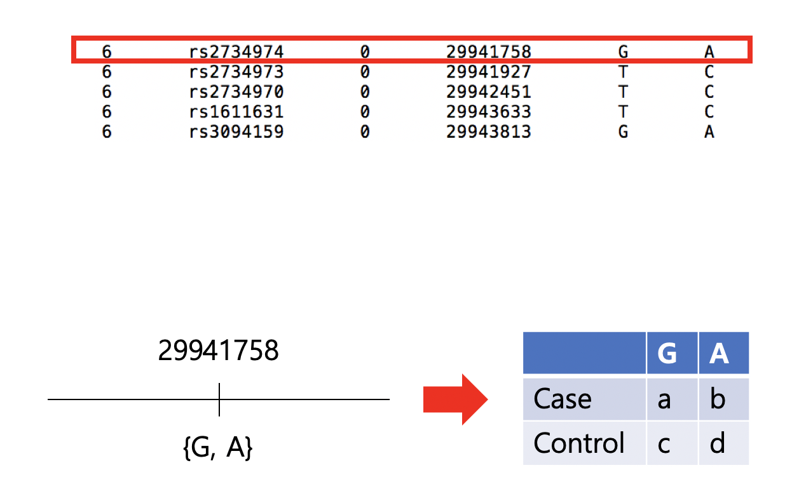
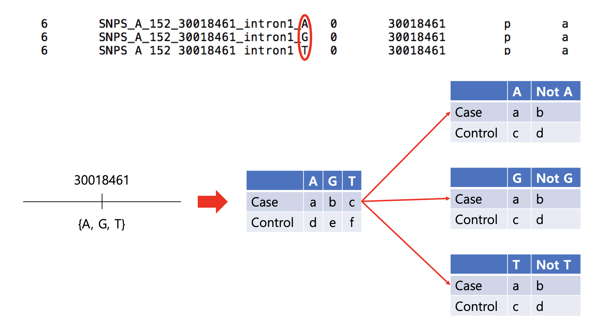
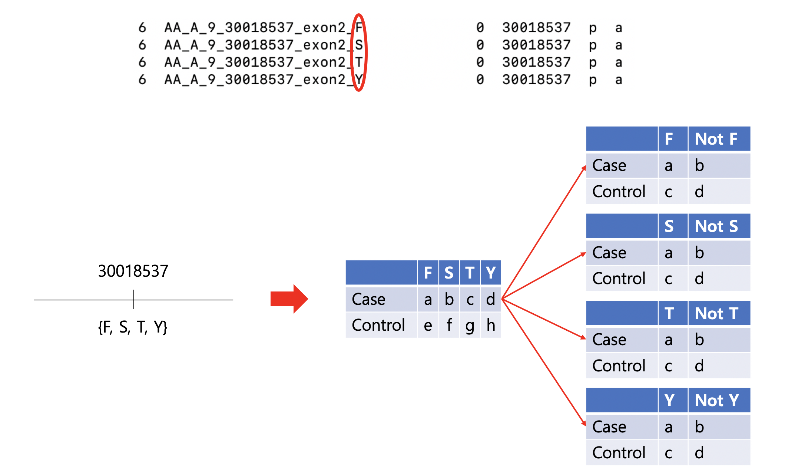

# bMarkerGenerator


## (1) Introduction

<!-- In most association test framework, a marker is supposed to represent only 2 factors. This assumption is appropriate because the most of genomic positions are actually bi-allelic. However, there are some genomic positions where more than 2 kind of SNP alleles can be found, i.e. tri-allelic or more. Most of genomic positions in HLA region are not bi-allelic due to its polymorphic characteristic. Furthermore, when it comes to  amino acid residue sequence of which the positions can have roughly 22 kinds of amino acid residues, it's impossible to perform the conventional association test just as it is.

bMarkerGenerator provides a solution for this. For each position which has more than 2 factors, bMarkerGenerator generates binary markers where each fator is allocated disjointly and represent its 'P'resence' or 'A'bsence. For example, assume one position of amino acid sequence has 3 factors, e.g. V(Valine), S(Serine), P(Proline). Then three binary markers, 'AA_A_-12_30018537_V', 'AA_A_-12_30018537_S' and 'AA_A_-12_30018537_P', are generated by bMarkerGenerator. By extending this idea one step further, Markers like 'AA_A_-12_30018537_VS' represent the existence of the case where there both factors 'Valine' and 'Serine' are. Then, the generated marker panel will be used for association test. -->

bMarkerGenerator generates a marker panel where the polymorphic variaiton of the HLA region is applied. 

In `Genome-Wide Association Study(GWAS)` and `Next-generation Sequencing` analysis, all `Single Nucleotide Polymorphism(SNP)` are assumed to be bi-allelic, i.e. there are only two variations in each SNP. In most SNPs in the human genome, this is actually true. However, SNPs in the `HLA region` are often more than bi-allelic because this HLA region has extreme polymorphism. In other words, when it comes to the HLA region, NGS technique with Human Reference Genome and most SNP array panels usually can't fully cover the variation of this region. That's why the result of the association test on the HLA region with those techniques is usually unreliable.

bMarkerGenerator solves this problem by using a similar strategy which `SNP2HLA` used, _binary marker_.
(http://software.broadinstitute.org/mpg/snp2hla/ - SNP2HLA)

<br>
<br>

## (2) Binary Marker

Typical markers labeled with dbSNP id in most genotype data represent the possible two variations of each position. As most SNPs are bi-allelic, these markers can successfully represent those SNPs. For instance, the SNP in the position 29941758 has two possible variations, allele 'G' or 'A'. The marker with the dbSNP id 'rs2734979' represents this SNP and its status will be reduced to 2 x 2 table. Most of the association study performs an association test that is based on this 2 x 2 table.





On the other hand, If some SNP has more than 2 variations, e.g. SNPs in the HLA region, then the above strategy can't be used as it is. Here comes in the _binary marker_ strategy. For example in the next photo, the position 30018461 which has three variations, allele A, G, and T, will be reduced to the 2 x 3 table. The _binary marker_ strategy disjointly divides this 2 x 3 table into a new three 2 x 2 tables where the 3 is the number of variations. In each new 2 x 2 table, the column will represent the **Presence(p)** and **Absence(a)** of each variation.




In terms of amino acids, it is far more common for each position to have multiple variations than SNPs. With the same _binary marker_ strategy, divide the 2 x 4 table into four 2 x 2 tables so that each of them represents respective amino acid residues.




<br>
<br>


## (3) Four classes of Markers

With the conventional intergenic SNP markers(ex. rs41557221), 3 classes of markers representing the variants in the HLA region will be included in a newly generated marker panel.

1. HLA allele binary marker (ex. HLA_A*01:01)
2. Amino acid residue binary marker (ex. AA_A_9_30018537_F, AA_A_-15_30018338)
3. DNA sequence base pair binary marker (ex. SNP_A_30018457, SNP_A_30018461_A)
4. Intergenic SNP variant marker (ex. rs41557221)

<br>
<br>


## (4) Usage Examples

```
python3 HATK.py \
    --bmarkergenerator \
    --variants example/wtccc_filtered_58C_RA.hatk.300+300.chr6.hg18 \
    --chped example/wtccc_filtered_58C_RA.hatk.300+300.imgt3320.2field.chped \
    --out MybMarkerGenerator/RESULT_EXAMPLE_wtccc_filtered_58C_RA.hatk.300+300.chr6.hg18 \
    --hg 18 \
    --dict-AA example/RESULT_EXAMPLE/HLA_DICTIONARY_AA.hg18.imgt3320 \
    --dict-SNPS example/RESULT_EXAMPLE/HLA_DICTIONARY_SNPS.hg18.imgt3320
```

The '--variant' argument takes intergenic SNP variant information. Other binary markers for HLA variants are created from the files given to the arguments '--chped', '--dict-AA', and '--dict-SNPS'.

> '--chped' takes the output from NomenCleaner.

> '--dict-AA' and '--dict-SNPS' take the output from IMGT2Seq.

<br>

bMarkerGenerator can work without the '--variants' argument. In this case, Only Markers representing the variants in the HLA region will be created.

```
python3 HATK.py \
    --bmarkergenerator \
    --chped example/wtccc_filtered_58C_RA.hatk.300+300.imgt3320.2field.chped \
    --out MybMarkerGenerator/RESULT_EXAMPLE_wtccc_filtered_58C_RA.hatk.300+300.chr6.hg18 \
    --hg 18 \
    --dict-AA example/RESULT_EXAMPLE/HLA_DICTIONARY_AA.hg18.imgt3320 \
    --dict-SNPS example/RESULT_EXAMPLE/HLA_DICTIONARY_SNPS.hg18.imgt3320
```
