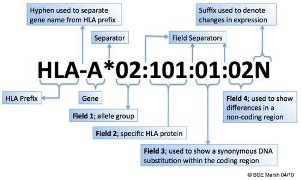
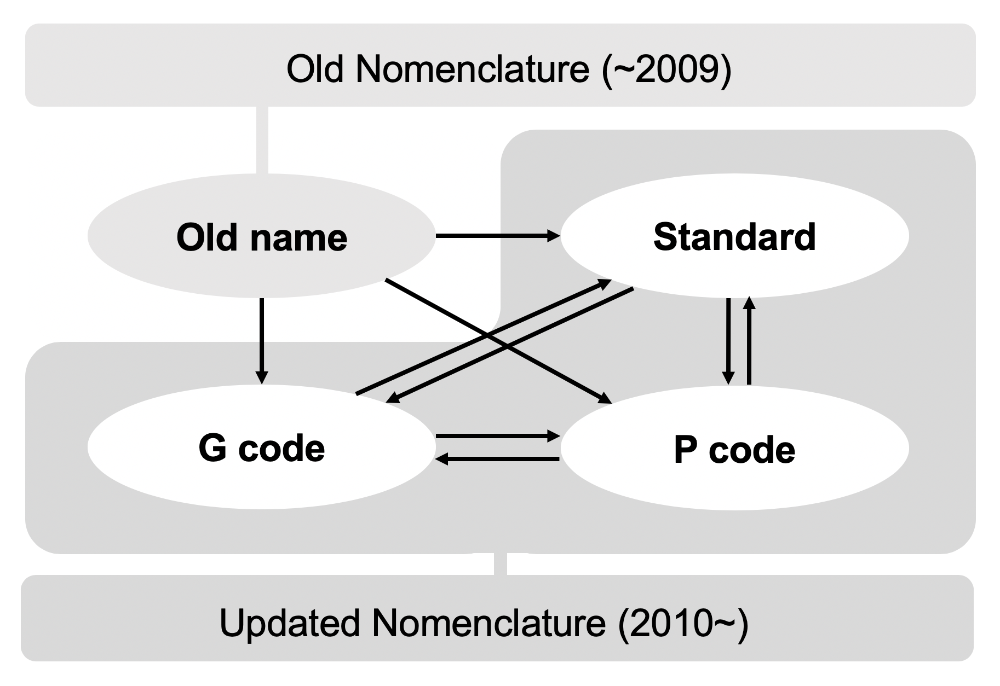
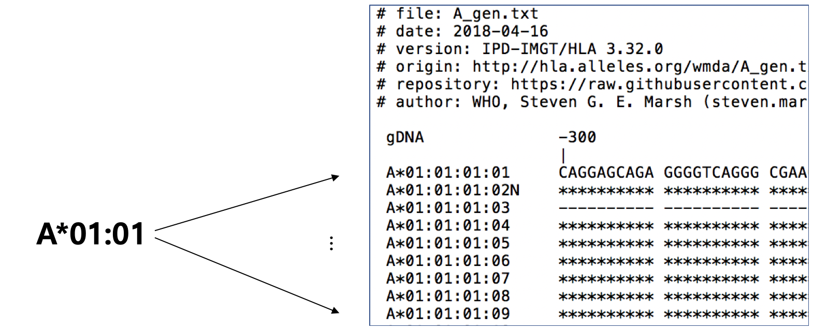
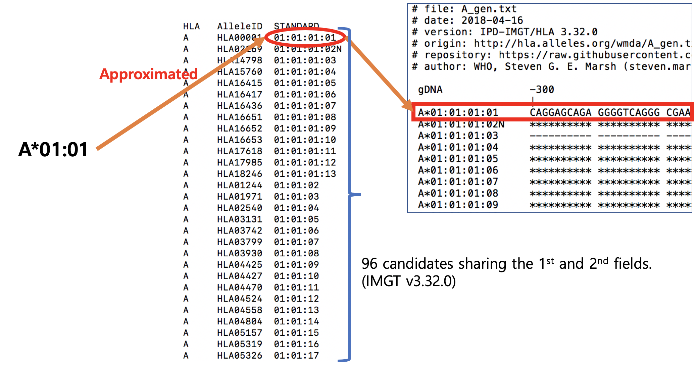
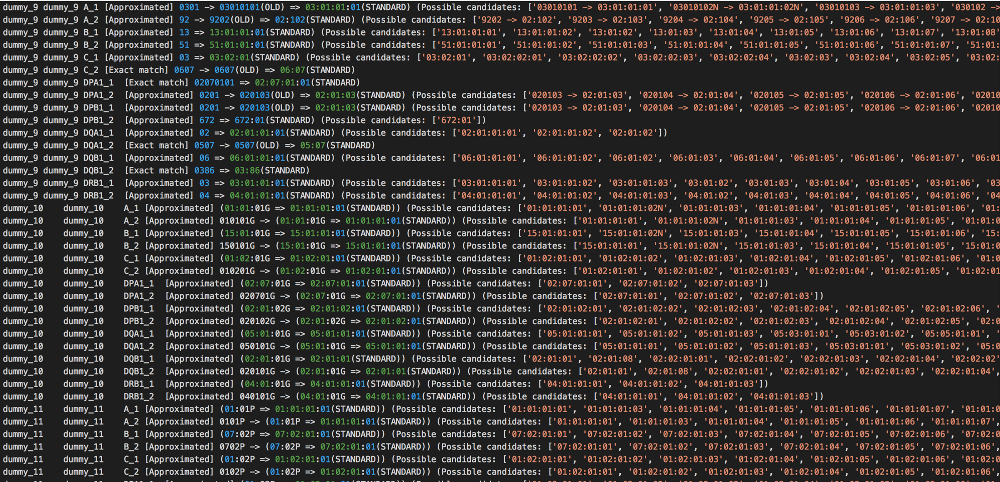
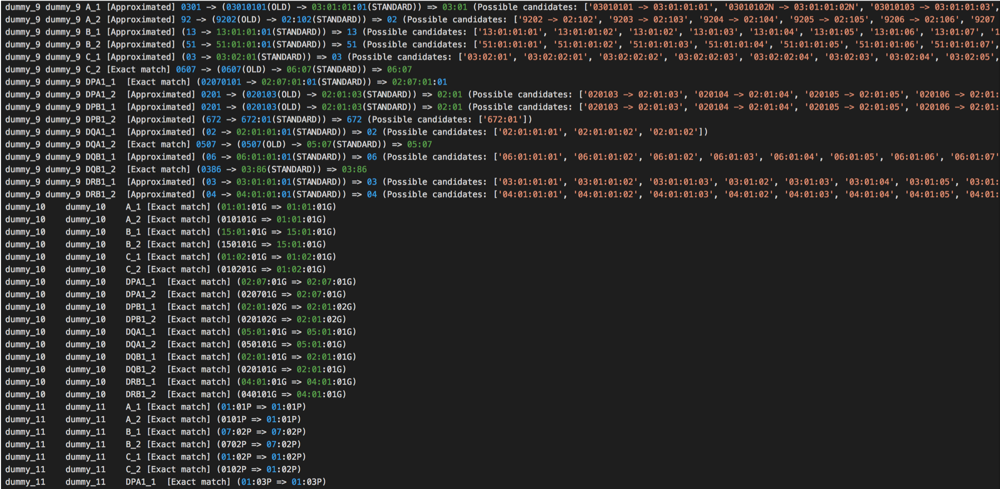

# NomenCleaner

## (0) Backgrounds

#### [Old vs. Updated Nomenclature]

The '`WHO Nomenclature Committee for Factors of the HLA System`' defined the official nomenclature for HLA alleles for the 1st time in 1987. However, as more and more new HLA alleles were found, that nomenclature became not enough to embrace all alleles, which was called 'rollover' problem. So, the committee met and did a major update to the old nomenclature in April 2010. (http://hla.alleles.org/nomenclature/naming_2010.html).

In **the old nomenclature**, HLA allele name is supposed to have 

1. Only 2 digits in each field.
2. No field separator.

On the other hand, in **the updated nomenclature**, HLA allele name has

1. 2 to 3 digits in each field
2. Field separators



(http://hla.alleles.org/nomenclature/naming.html)


<!-- The IPD-IMGT/HLA database currently uses the updated one and researchers should use it. However, there are some practical reasons that hinder its usage.

- It can be burdensome for preceding researchers to move from the old to updated nomenclature.
 -->

<br>

#### [G-group and P-group nomenclature]

Refer to the next link for the official definition of G-group and P-group nomenclatures. (http://hla.alleles.org/nomenclature/naming_2010.html - '3. Reporting of ambiguous HLA allele typing') 

HLA typing technologies, which is the gold-standard way to obtain patients' HLA type information, still face a challenge in getting the fully resolved HLA type, i.e. determining all fields exactly. Consequently, **it is quite common to skip 3rd and 4th fields in order to aggregate multiple possible answers**.
To deal with this, the committee introduced G and P codes in the updated nomenclature. 

* G-group: HLA alleles that share identical nucleotide sequences for the exons encoding the peptide-binding domains.
* P-group: HLA alleles that encode for identical peptide-binding domains.

Because most HLA typing technologies focus on resolving alleles that encode differences within the peptide binding domains, those classification criteria can effectively represent an ambiguous result of typing strategies.


<br>

#### [Background Summary]

1. There are practically 4 nomenclatures to distinguish, (1) `Old`, (2) `Updated(Standard)`, (3) `G-group`, and (4) `P-group`.
2. Determining the 3rd and 4th fields unambiguously is a challenging job even for the current HLA typing technologies. That's why G-group and P-group nomenclatures are additionally introduced in the updated nomenclature.


<br>
<br>


## (1) Introduction

`NomenCleaner` is a module to help researchers to solve challenges related to HLA nomenclature. Two major challenges would be (1) Conversion between nomenclatures, and (2) Field checking.


1. Conversion



NomenCleaner converts a given set of HLA alleles which is in arbitrary nomenclature to the ones in the updated nomenclature. **The conversion from the updated to old nomenclature is NOT available**.

<br>

2. Field checking

**Often, the field separator is removed though given HLA allele conforms to the updated nomenclature**. This barely causes a problem in most cases, however, there is definitely some case that may confuse researchers. For example, if the HLA allele **DPB1\*101101** is given, then some researchers may be perplexed as to which one is right among <U>DBP1\*10:11:01</U>, <U>DPB1\*101:101</U> and <U>DPB1\*1011:01</U>. NomenCleaner searches the `HAT(HLA Allele Table)` file, which contains whole HLA allele name information of the IMGT database of a specific version, and determines that **DPB1*1011:01 is the only valid solution**. (cf. DBP1*1011:01 is in the IMGT database of the version 3.37.0.)


<br>
<br>


## (2) Usage Examples

NomenCleaner basically takes `HPED` file(e.g. '\*.hped') and `HAT(HLA Allele Table)` file (e.g. '\*.hat') as input, then performs its jobs as required by the user. Finally the NomenCleaner generates `Cleaned HPED(CHPED)` file, e.g. '\*.chped', which contains the converted HLA alleles and its log file, e.g. '\*.chped.log'.

> The `HPED` file can be generated by the module `HLA2HPED`. The `HAT(HLA Allele Table)` file is generated by the module `IMGT2Seq`. Please check 'docs/_0_HLA2HPED.md' and 'docs/_1_IMGT2Seq.md' README files of those modules for more detailed information.

<br>

**There are two main ways of using the NomenCleaner**. The 1st one is to specify the output nomenclature and the other one is not.

1. Specifying the output nomenclature, i.e. passing the arguments of either '--1field', '--2field', '--3field', '--4field', '--Ggroup', or '--Pgroup'.
2. Specifying **NO** output nomenclature.

<br>
<br>

### [1. Specifying the output nomenclature]

Users can specify the output nomenclature by passing either argument of '--1field', '--2field', '--3field', '--4field', '--Ggroup', or '--Pgroup'.

- The standard: '--1field', '--2field', '--3field', '--4field'
- G-group: '--Ggroup'
- P-group: '--Pgroup'

The number in the arguments '--1field', '--2field', '--3field', and '--4field' means **the maximum number of fields** of the output alleles. For example, if the user passes the '--3field' argument, then all converted alleles in the output `CHPED` file will have a maximum of 3 fields and the 4th field value will be discarded.

```
python3 HATK.py \
    --nomencleaner \
    --hat example/RESULT_EXAMPLE/HLA_ALLELE_TABLE.imgt3320.hat \
    --hped example/wtccc_filtered_58C_RA.hatk.300+300.hped \
    --out MyNomenCleaner/RESULT_EXAMPLE_wtccc_filtered_58C_RA.hatk.300+300.chr6.hg18.2field \
    --2field \
    --imgt 3320
```

<br>

### [2. Specifying **NO** output nomenclature]

If a user doesn't specify the output field, then the NomenCleaner will perform the next jobs.

<!-- - First of all, the NomenCleaner will check or automatically guess the number of fields for each HLA allele in the HPED file.
- If the allele doesn't have the field separator, then the NomenCleaner will check whether that allele belongs to the old or updated nomenclature.
- If the allele belongs to the old nomenclature, then it will be converted to the one in the standard name of the updated nomenclature with the previously confirmed number of fields.
- If the allele belongs to the updated nomenclature(standard, G-group, or P-group), then the NomenCleaner won't perform any conversion but will insert the field separator.
- If the allele has the field separoator at first, then it will be considered as an allele in the updated nomenclature -->

- If the allele belongs to the old nomenclature, then it will be converted to have the standard name of the updated nomenclature with the field separator.
- If the allele belongs to the updated nomenclature but doesn't have the field separator, then the NomenCleaner will only insert the field separator.
- If the allele doesn't belong to the above 2 cases, then it will be just returned as it is.
- In the end, the alleles in the `HPED` file will belong to one of the updated nomenclatures, having the field separator and the same number of fields as it originally had.

<!-- i.e. old -> standard, standarad -> standard, G-group -> G-group, P-group -> P-group, while each converted allele has the same number of fields as that of its original fields. -->

```
python3 HATK.py \
    --nomencleaner \
    --hat example/RESULT_EXAMPLE/HLA_ALLELE_TABLE.imgt3320.hat \
    --hped example/wtccc_filtered_58C_RA.hatk.300+300.hped \
    --out MyNomenCleaner/RESULT_EXAMPLE_wtccc_filtered_58C_RA.hatk.300+300.chr6.hg18 \
    --imgt 3320
```

<br>
<br>

## (3) Mapping based on Approximation

<!-- Somebody would have a question how the allele with less than 3 fields can be converted to the one with 3 or 4 fields. -->

The amino acid and DNA sequence information distributed by the `IMGT-HLA` database are as below, the right rectangle.



You can see that each sequence is given as paired with the HLA allele in the standard name with a maximum of 4 fields.

However, It was mentioned in '(0) Backgrounds' section that it is quite a challenge even for the current HLA typing technology, which is the gold-standard way to obtain patients' HLA type, to resolve all 4 fields unambiguously. So, most of HLA type information given to HLA researchers will be in a maximum of 2 fields, which naturally implies that researchers can't use the IMGT sequence information as it is.

To solve this problem, the NomenCleaner maps the allele with a maximum 2 of fields to the 1st one among the possible candidates that share the same fields in the `HAT(HLA Allele Table)`. For example, in the next photo, the allele A\*01:01 will be mapped(approximated) to A\*01:01:01:01 where there are 96 candidates sharing the same 1st and 2nd fields. By doing this, HATK can bring amino acid and DNA sequence information and  generate a marker panel based on that information.



Likewise, if the user asks the NomenCleaner to convert an allele to the one with more fields than the original one, then it will do the same approximation.

The approximation or exact match that happens in the process of the NomenCleaner will be recorded in the log file, e.g. *.chped.log, so that the users can make their own decision to use the result as it is or not.

<!-- <br>
<br>


## (4) Log file example




 -->
