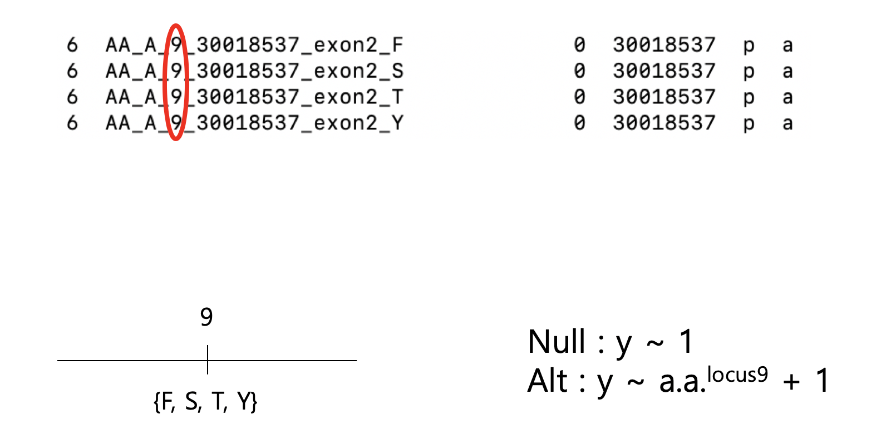
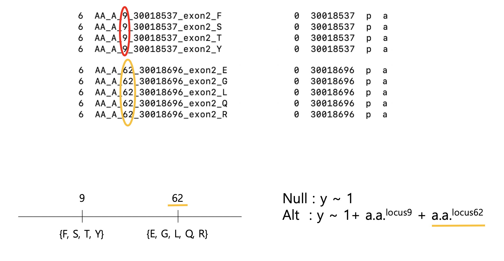

# Omnibus Test

## (1) Introduction

The Omnibus test performs a likelihood ratio test between the null model and the alternative model. In HLA analysis, the null model is "There is no effect of amino acids." and the alternative model is "There is an effect of some amino acid position(s).".




<br>
<br>


## (2) Setting condition and Phasing

By default, the omnibus test module performs the test for each amino acid position. Each alternative model will have a single amino acid position as a variable.

The setting condition means adding an amino acid position as an additional covariate to each alternative model.

**Phasing is required when performing the omnibus test with conditions** because the setting condition is considering more than one position(locus) of amino acid sequence.





<br>
<br>


## (3) How to perform phasing

We recommend using Beagle(v3.x.x) software to phase target data. The official instruction is available at https://faculty.washington.edu/browning/beagle/b3.html

> Phasing output generated from BEAGLE with version 4.x.x and 5.x.x can also be used in the Omnibus Test. However, BEAGLE with those version doesn't allow markers to have the same base position while HATK generates a bunch of markers which share the same base position. **So, It is recommended to just use BEAGLE with the version 3.x.x to generate the phased beagle file of the HATK output**.

<br>
<br>

## (4) Usage Examples

When no condition(i.e. when interested in only one amino acid locus) is set, phasing isn't needed. However, you can just pass the unphased beagle file(e.g. *.bgl) to the argument '--phased'.

```
$ python3 HATK.py \
    --omnibus \
    --fam example/wtccc_filtered_58C_RA.hatk.58C_RA.300+300.chr6.hg18.fam \
    --phased example/RESULT_EXAMPLE_wtccc_filtered_58C_RA.hatk.58C_RA.300+300.chr6.hg18.bgl.phased \
    -o MyOmnibusTest/RESULT_EXAMPLE_wtccc_filtered_58C_RA.hatk.58C_RA.300+300.chr6.hg18 \
    --pheno example/wtccc_filtered_58C_RA.hatk.58C_RA.300+300.phe \
    --pheno-name RA

```

The input '\*.bgl.phased' file is first processed to '\*.aa' file, which is genuine input of the Omnibus Test. Once the '\*.aa' file of the input '\*.bgl.phased' has been generated, then you don't need to repeat this process. The user can skip this with '--aa' argument.

```
$ python3 HATK.py \
    --omnibus \
    --fam example/wtccc_filtered_58C_RA.hatk.58C_RA.300+300.chr6.hg18.fam \
    --aa example/RESULT_EXAMPLE_wtccc_filtered_58C_RA.hatk.58C_RA.300+300.chr6.hg18.aa \
    -o MyOmnibusTest/RESULT_EXAMPLE_wtccc_filtered_58C_RA.hatk.58C_RA.300+300.chr6.hg18 \
    --pheno example/wtccc_filtered_58C_RA.hatk.58C_RA.300+300.phe \
    --pheno-name RA

```
This 2nd example will generate the same output as that of the 1st example.


If you want to set another marker(possibly another amino acid position) as a covariate in the omnibus test, you can set this with '--condition' argument. If you want to pass more than 1 condition, then pass them as 'comma-separated (single) string'.

```
$ python3 HATK.py \
    --omnibus \
    --fam example/wtccc_filtered_58C_RA.hatk.58C_RA.300+300.chr6.hg18.fam \
    --aa example/RESULT_EXAMPLE_wtccc_filtered_58C_RA.hatk.58C_RA.300+300.chr6.hg18.aa \
    -o MyOmnibusTest/RESULT_EXAMPLE_wtccc_filtered_58C_RA.hatk.58C_RA.300+300.chr6.hg18 \
    --pheno example/wtccc_filtered_58C_RA.hatk.58C_RA.300+300.phe \
    --pheno-name RA \
    --condition AA_A_-15
    # --condition AA_A_-15,AA_DRB1_166 (when passing multiple coditions.)

```

(Tip) To sort the output of the omnibus test on P-value, Use the below bash command.
```
$ sort -gk 5 MyOmnibusTest/RESULT_EXAMPLE_wtccc_filtered_58C_RA.hatk.58C_RA.300+300.chr6.hg18.RA.NA.omnibus
```