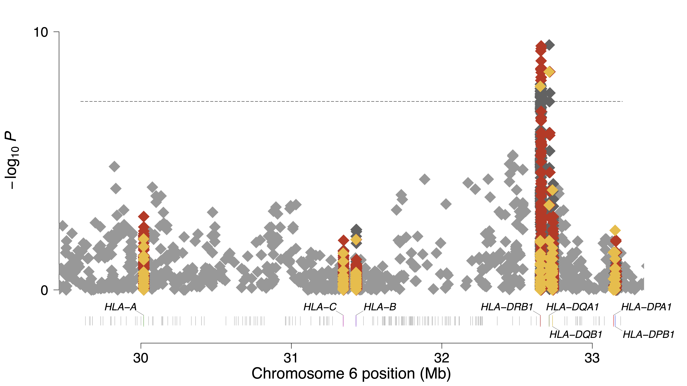
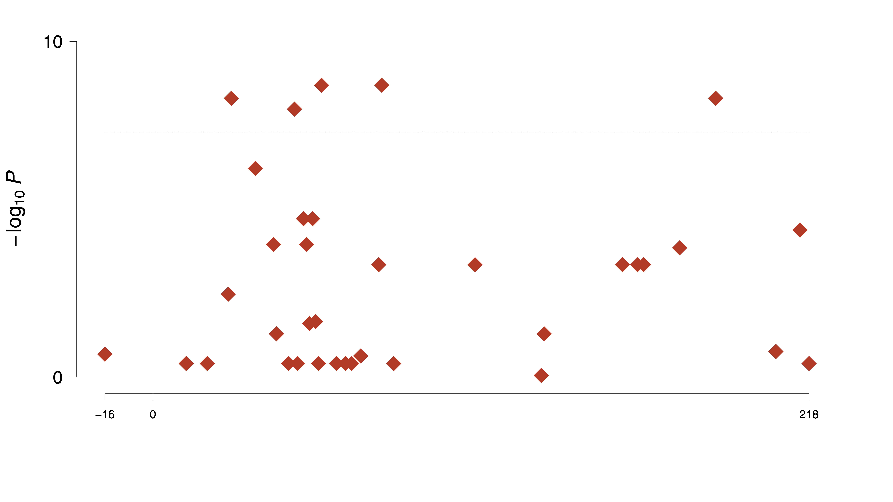

# Manhattan Plot

## (1) Introduction
The Manhattan plot is an indispensable method to visualize the result of the association test. HATK provides the module to plot this.

<br>

## (2) Usage Examples

1. Logistic regression result

```
$ python HATK.py \
    --manhattan \
    --ar example/RESULT_EXAMPLE/RESULT_EXAMPLE_wtccc_filtered_58C_RA.hatk.300+300.chr6.hg18.assoc.logistic \
    --imgt 3320 \
    --hg 18 \
    --out MyManhattan/RESULT_EXAMPLE_wtccc_filtered_58C_RA.hatk.300+300.chr6.hg18
```

2. Omnibus Test result

```
$ python HATK.py \
    --manhattan \
    --ar example/OmnibusTest/wtccc_filtered_58C_RA.hatk.300+300.chr6.hg18.RA.NA.omnibus \
    --imgt 3320 \
    --hg 18 \
    --out MyManhattan/wtccc_filtered_58C_RA.hatk.300+300.chr6.hg18.RA.NA.omnibus \
    --HLA A DRB1 DQA1 DQB1
```

## (3) Result Example

(3-1) Manhattan plot of association test.



- Yellow: HLA marker (ex. HLA_A*01:01)
- Red: Amino acid marker (ex. AA_A_9_30018537_F, AA_A_-15_30018338)
- Dark grey: Intragenic DNA base pair marker (ex. SNPS_A_30018457, SNPS_A_30018461_A)
- Ligtht grey: Intergenic dbSNP marker (ex. rs41557221)

<br>

(3-2) Manhattan plot of the omnibus test.



As omnibus test is peformed restricted to only amino acid markers, Only the signals of amino acid positions are shown in the omnibus Manhattan plot.
