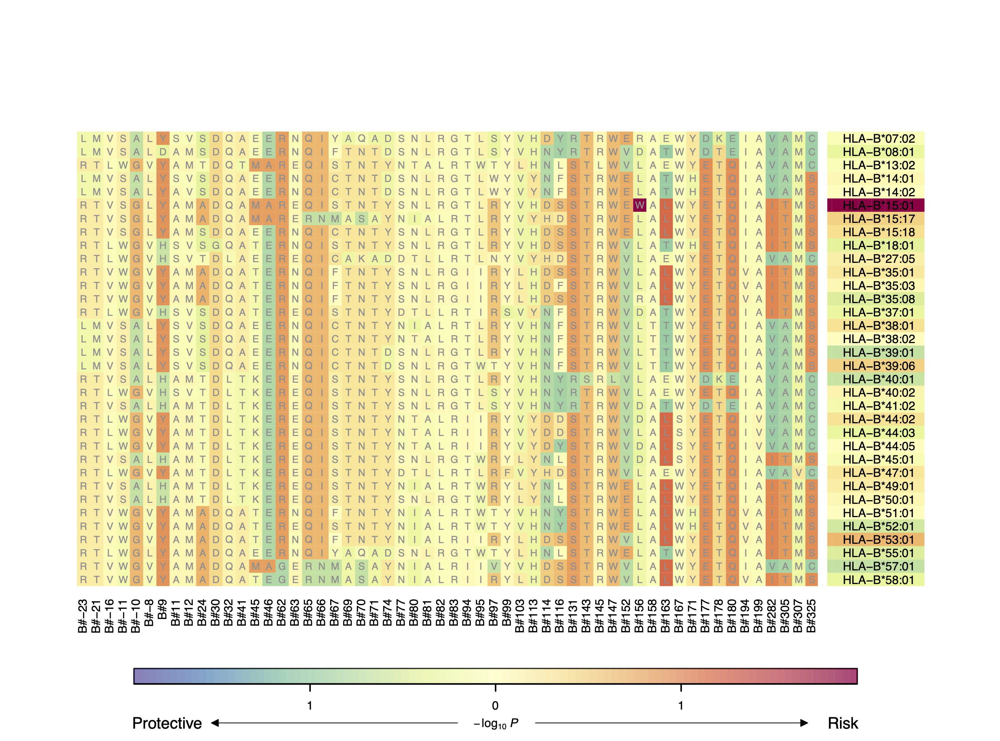

# Heatmap

## (1) Introduction

HATK provides the module to plot the Heatmap which targets to show the significance of the (1) HLA allele markers and (2) amino acid markers.

<br>

## (2) Usage Example

```
$ python HATK.py \
    --heatmap \
    -ar example/RESULT_EXAMPLE/RESULT_EXAMPLE_wtccc_filtered_58C_RA.hatk.58C_RA.300+300.chr6.hg18.assoc.logistic \
    --HLA A \
    --maptable example/RESULT_EXAMPLE/HLA_MAPTABLE_A.hg18.imgt3320.txt \
    -o MyHeatmap/RESULT_EXAMPLE_wtccc_filtered_58C_RA.hatk.58C_RA.300+300.chr6.hg18
```

<br>

## (3) Result Example


- The cells on the right side represent the signals of HLA allele markers.
- The cells in the main part represent the signals of amino acid markers. The characters are the amino acid residue values and Each column is the position of the amino acid sequence.